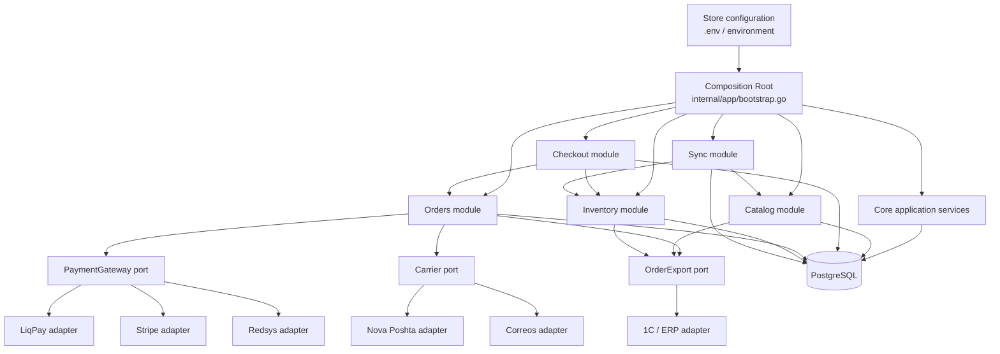

# ecommerce-core — Target Architecture

## 1. Mission and scope

`ecommerce-core` is a reusable, single-codebase e-commerce engine. It must be
possible to launch a new store (for example, a B2C cosmetics store in Spain)
from the same repository by selecting configuration and enabled modules, not by
forking or rewriting the core.

The engine is a **clean-slate project**. It has no obligation to migrate or
remain compatible with a predecessor database, API, provider payload, or store
deployment. The old codebase may inform behaviour while modules are rebuilt,
but it is not a schema or API contract.

The repository is **not** a collection of client-specific applications. Store
identity, locales, currency, providers, taxes, checkout rules, inventory mode,
and enabled modules are configuration. Stable commercial invariants, security,
orders, reservations, and provider-neutral workflows are core.

**A fork per store is prohibited.** Store-specific behaviour belongs to one of:

- typed store configuration;
- a reusable module;
- an adapter implementing an existing port;
- an explicitly versioned extension schema.

## 2. Architectural principles

1. **Composition over forks.** One codebase, one deployable application shape;
   each deployment receives a validated store configuration.
2. **Dependency inversion.** Core/application services depend on domain ports,
   never on LiqPay, Stripe, Nova Poshta, 1C, GORM, Gin, or an SDK.
3. **Explicit module boundaries.** A module owns its data, migrations, use
   cases, and adapters. It does not mutate another module's internals.
4. **Database is not the integration boundary.** External ERP systems interact
   through Sync ports, idempotent webhooks, and reliable outbound events.
5. **Configuration is validated at startup.** An invalid provider combination
   must fail fast before the HTTP server starts.
6. **Core is stable; extensions are additive.** Store verticals add tables in
   their module schema rather than adding arbitrary columns to `core.product`,
   `core.user`, or `core.order`.

## 3. Target module interaction



Gin is a delivery adapter only. HTTP handlers authenticate, validate and map
requests to application use cases; they do not choose a provider or implement
commercial rules.

Every state-changing checkout request carries an `Idempotency-Key`. The HTTP
adapter derives a stable checkout identity from it, so browser retries cannot
create a second order, reservation, or payment attempt. If a response is lost
after the provider call, the same key replays the provider checkout and returns
a new browser session without persisting redirect fields or client secrets.

## 4. Composition Root and configuration

`internal/app/bootstrap.go` is the sole Composition Root. It is responsible
for validating configuration, constructing repositories, policies, enabled
adapters and worker instances. `cmd/api/main.go` starts and stops the assembled
`Application` lifecycle after the HTTP server has drained requests.

`internal/http/router.go` must only wire already-created handlers and
middleware. It must not instantiate an SDK or contain provider selection.

### 4.1 Example store configuration

```env
STORE_CODE=cosmetics-es
STORE_NAME=Cosmetica ES
DEFAULT_LOCALE=es
SUPPORTED_LOCALES=es,en,ca
FALLBACK_LOCALE=es

CURRENCY=EUR
PRICE_SCALE=2
TAX_MODE=vat_included
VAT_RATE=21

PAYMENT_PROVIDERS=stripe,redsys
PAYMENT_DEFAULT=stripe
SHIPPING_PROVIDERS=correos
SHIPPING_DEFAULT=correos

INVENTORY_MODE=external_1c
ENABLED_MODULES=inventory,sync,reviews,promos
DEFAULT_WAREHOUSE_ID=11111111-1111-4111-8111-111111111111
CHECKOUT_ALLOW_GUEST=true
CHECKOUT_REQUIRE_PHONE=true
```

Environment variables carry deployment configuration and secrets; values are
parsed into typed structures such as `StoreConfig`, `PaymentsConfig`,
`DeliveryConfig`, `InventoryConfig`, and `CheckoutPolicy`. Application services
receive only the narrow policy or port they need, never a giant global config.

`DEFAULT_WAREHOUSE_ID` is the initial inventory-allocation policy: the UUID of
an active local warehouse from which checkout reserves stock. It is not a
carrier sender address. Carrier-specific sender references remain adapter
configuration (for example, `NP_SENDER_*`) and never leak into Core or Orders.

Provider factories select only enabled adapters:

```go
type PaymentGateway interface {
	Code() string
	CreateCheckout(context.Context, CheckoutPayment) (PaymentSession, error)
	VerifyWebhook(context.Context, WebhookRequest) (PaymentEvent, error)
	Refund(context.Context, Payment) error
}

type Carrier interface {
	Code() string
	Quote(context.Context, ShipmentQuoteRequest) ([]ShippingOption, error)
	CreateShipment(context.Context, CreateShipmentRequest) (ShipmentResult, error)
	Track(context.Context, TrackingRequest) (TrackingResult, error)
}
```

`Carrier` receives a provider-neutral recipient address, optional opaque
`LocalityID`/`ServicePointID`, shipment items and declared value. An adapter
validates its own carrier-location identifiers; core never stores a field such
as `nova_poshta_warehouse_ref` or `correos_office_id`.

`PaymentGateway` and `Carrier` are ports owned by the core/domain layer. Their
implementations live in `internal/adapters/...`. Provider callback payloads are
decoded and verified inside an adapter, then converted to a provider-neutral,
idempotent domain event.

A payment session may expose either a provider-hosted `redirect_url` (with
ephemeral signed form fields, when the provider requires an HTTP POST) or an
ephemeral `client_secret` for an in-page flow. These values are returned only
to the buyer, are never written to an order or logs, and are not stable payment
credentials.

### 4.2 Startup validation

Bootstrap must reject a configuration when:

- `PAYMENT_DEFAULT` or `SHIPPING_DEFAULT` is not enabled;
- an enabled adapter lacks its required credentials;
- a configured locale is invalid, duplicated, or has no fallback;
- `PRICE_SCALE`, currency, tax mode, or inventory mode is unsupported;
- a required module is disabled;
- an external inventory mode has no configured Sync adapter.

## 5. Inventory and Sync

Inventory is pluggable. The engine always owns checkout consistency,
reservation lifecycle, and the order snapshot; it does not always own the
upstream source of truth.

### 5.1 Inventory modes

| Mode | Source of truth | Admin capabilities | Local database role |
|---|---|---|---|
| `internal` | ecommerce-core PostgreSQL | Full catalog and stock editing | Authoritative operational store |
| `external_1c` | 1C/ERP | Stock changes blocked; catalog changes controlled by policy | Read model / storefront cache |
| `external_<erp>` | Named external ERP | Same contract as `external_1c` | Read model / storefront cache |

In external mode, the UI and API must return a clear authorization/domain error
for forbidden stock mutations. This is enforced in the Inventory application
service, not merely hidden in an admin screen.

### 5.2 Sync module

The Sync module provides ports for two directions:

```go
type CatalogImport interface {
	ApplyCatalogChange(context.Context, CatalogChange) error
	ApplyStockChange(context.Context, StockChange) error
}

type OrderExporter interface {
	ExportOrder(context.Context, OrderSnapshot) error
}
```

- Inbound ERP webhooks are authenticated, validated, versioned and idempotent.
  They update the local read model through application use cases, never through
  direct SQL in the HTTP handler.
- Outbound order delivery uses an **outbox table** written in the same database
  transaction as order creation. A worker retries delivery with an idempotency
  key. Do not make a remote ERP call inside the order transaction.
- Every imported record stores external ID, source, version/updated timestamp,
  payload hash and synchronization state so duplicates and stale updates can be
  rejected deterministically.

### 5.3 Reservations and race conditions

Regardless of mode, checkout creates a local reservation atomically before a
payment session is started. Reservation expiry, release on failed/expired
payment, and conversion to committed allocation after successful payment are
core responsibilities.

For an external ERP, ecommerce-core reserves locally first and sends a
reservation/order event through Sync. Reconciliation workers handle delayed ERP
responses. Overselling is never solved by trusting a browser request or by
letting an adapter decide stock rules.

## 6. Data model and migrations

### 6.1 Migration ownership

```text
migrations/
├── core/                         # stable engine schema
│   ├── ..._users.up.sql
│   ├── ..._orders.up.sql
│   └── ..._catalog.up.sql
└── modules/
    ├── inventory/
    │   ├── ..._stock_item.up.sql
    │   └── ..._reservation.up.sql
    ├── sync/
    │   └── ..._outbox.up.sql
    └── cosmetics/
        └── ..._product_details.up.sql
```

The first core migration is a clean baseline for a new PostgreSQL database. The
migration runner applies core first, then enabled modules in deterministic
lexicographic order. Core uses `schema_migrations`; each module uses its own
`schema_migrations_module_<module>` table to avoid version collisions. After a
migration is applied to an environment, it is immutable; use a new forward
migration for later changes.

Core owns universal entities: users, roles, base catalog, carts, orders,
payments, deliveries, locales and audit records. Modules own their extension
tables. For example, cosmetics uses `cosmetics_product_details(product_id, ...)`
and inventory uses `stock_item(variation_id, warehouse_id, ...)`; neither adds
vertical-specific columns to `core.product`.

### 6.1.1 Cross-module references

Each module owns its migration history and tables. A module may store another
context's UUID (for example `inventory.stock_items.variant_id`), but it must
not declare a PostgreSQL foreign key to that context's table. The owning
application service validates the referenced aggregate through a port; a
provider-neutral workflow owns transactions that must change multiple contexts
atomically. This keeps module schema evolution independent while retaining the
commerce invariants of reservation and order creation.

Cross-context SQL belongs only in a named infrastructure transaction adapter
under `internal/platform/postgres/...`; core/domain and module application
packages must not import another module's concrete repository.

### 6.2 Localization

All translatable business content is stored in normalized translation tables:

```sql
CREATE TABLE product_translation (
  product_id UUID NOT NULL REFERENCES product(id) ON DELETE CASCADE,
  locale VARCHAR(10) NOT NULL REFERENCES locale(code),
  name TEXT NOT NULL,
  slug TEXT NOT NULL,
  description TEXT,
  meta_title TEXT,
  meta_description TEXT,
  PRIMARY KEY (product_id, locale),
  UNIQUE (locale, slug)
);
```

Use the same convention for categories, attributes, units, badges, content
pages, and other human-readable data. Locale is `VARCHAR(10)` to support tags
such as `pt-BR` and `zh-Hans`.

**JSONB must not store multilingual descriptions or other translatable
business content.** It may be used only for genuinely schemaless,
non-localized provider payloads or metadata with a documented schema. New API
DTOs must use `translations: [{ locale, ... }]`, never `name_uk`, `name_en`,
or a new field per language.

## 7. Orders, money, tax and delivery rules

- Store money as an integer in the smallest configured monetary unit, plus an
  ISO 4217 currency code captured on the order/payment snapshot. No service may
  assume UAH, kopecks, two decimal places, or a provider's amount format.
- Tax calculation is a `TaxPolicy` selected at bootstrap. The order stores the
  computed tax snapshot, rate and tax mode; changing configuration must not
  rewrite historical orders.
- Checkout rules (guest checkout, phone verification, address requirements,
  minimum order, shipping promotions) are explicit policies, not `if` blocks
  tied to a country or provider.
- Order state uses immutable string codes such as `pending_payment`, `paid`,
  `fulfillment_pending`, `shipped`, `delivered`, `cancelled`, and `refunded`.
  Do not depend on numeric database IDs. State transitions are enforced by an
  order workflow policy and written to history.
- An order records provider codes and display snapshots. Providers may change
  later without corrupting historical data.
- A selected delivery stores a provider-neutral recipient/service-point
  snapshot in its own core-owned table. Payment success atomically enqueues a
  durable delivery job; a worker calls the selected carrier only after commit,
  with the job's stable idempotency key. PostgreSQL claims jobs with row locks;
  completion persists the carrier tracking number, while temporary failures are
  retried and a disabled provider is marked failed without an external call.

## 8. Target folder structure

```text
cmd/
└── api/
    └── main.go

internal/
├── app/
│   ├── bootstrap.go              # sole Composition Root
│   ├── config.go                 # typed config parsing and validation
│   └── workers.go
├── core/
│   ├── money/
│   ├── locale/
│   ├── tax/
│   ├── orderworkflow/
│   └── outbox/
├── catalog/
│   ├── domain/
│   ├── application/
│   ├── repository/postgres/
│   └── delivery/http/
├── checkout/
├── orders/
├── inventory/
│   ├── domain/
│   ├── application/
│   ├── repository/postgres/
│   └── delivery/http/
├── sync/
│   ├── domain/
│   ├── application/
│   ├── delivery/http/            # ERP webhooks
│   └── worker/
├── payments/
│   ├── domain/                   # PaymentGateway port
│   └── application/
├── delivery/
│   ├── domain/                   # Carrier port
│   └── application/
├── adapters/
│   ├── payment/{liqpay,stripe,redsys}/
│   ├── delivery/{novaposhta,correos}/
│   └── sync/{one_c,...}/
├── platform/                     # db, logger, security, email, storage
└── http/                          # Gin router and generic middleware

migrations/
├── core/
└── modules/{inventory,sync,cosmetics}/
```

The exact package names may be introduced incrementally, but dependency
direction is mandatory: delivery/adapters → application/domain ports → core;
never the reverse.

## 9. Golden development rules

1. Do not fork the repository for a store.
2. Do not hardcode a currency, locale, tax rate, store name, provider code, or
   country-specific checkout rule in domain/application code.
3. Do not import an external provider SDK into a core, order, checkout, or HTTP
   handler package.
4. Do not put payment, delivery, ERP, or order workflow logic in an adapter.
   Adapters translate protocols; application services decide business actions.
5. Do not create a new API field per language and do not store translatable
   content in JSONB.
6. Do not add client-vertical fields to core tables. Create an owned module
   table and migration instead.
7. Do not use numeric status IDs as business meaning. Use stable codes and
   explicit transition rules.
8. Do not call external systems inside a database transaction. Use the outbox,
   idempotency keys, retries and reconciliation.
9. Do not trust inventory quantities from the client. Reserve inventory in a
   transactional server-side workflow for every inventory mode.
10. Do not add a configuration option without startup validation, documented
    defaults, and tests for invalid combinations.
11. Do not commit `.env` files or provider secrets. Commit `.env.example` with
    placeholders only.
12. Every new adapter and module must have contract tests; every core workflow
    must have unit tests independent of HTTP, Docker, or a real provider.

## 10. Definition of done for architectural changes

A change is architecturally complete only when it has a documented owner,
configuration, migration ownership, ports/adapters boundary, validation,
observability, idempotency behaviour where external I/O exists, and tests at
the relevant boundary. A feature that works for one store but requires a core
edit for the next store is not complete.
