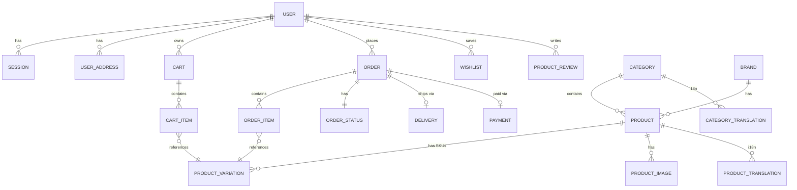
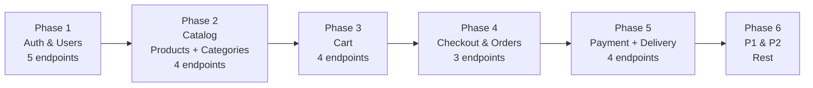

# 🔍 Аналіз мінімально необхідних API — AquaWheel Store

## Поточний стан проєкту

Проєкт має зрілу архітектуру (Clean Architecture / Modular Monolith), повну схему БД із 20+ таблиць, але **реалізовано лише 1 ендпоінт** — `GET /ping`. Усі доменні модулі (`internal/*`) містять лише `.gitkeep` заглушки.

---

## ER-діаграма ключових зв'язків

---

## Пріоритети

| Позначка | Опис |
|----------|------|
| **P0** 🔴 | Must-have для MVP. Без них магазин не працює |
| **P1** 🟡 | Потрібно для повноцінного досвіду покупця |
| **P2** 🟢 | Можна відкласти на другу ітерацію |

---

## 📋 Таблиця мінімально необхідних API

### 🔐 1. Auth & Users (`internal/user`)

| # | Метод | Ендпоінт | Опис | Пріоритет |
|---|-------|----------|------|-----------|
| 1 | `POST` | `/api/auth/register` | Реєстрація (email + пароль) | P0 🔴 |
| 2 | `POST` | `/api/auth/login` | Логін → access + refresh JWT | P0 🔴 |
| 3 | `POST` | `/api/auth/refresh` | Оновлення access token через refresh | P0 🔴 |
| 4 | `POST` | `/api/auth/logout` | Інвалідація сесії | P0 🔴 |
| 5 | `GET` | `/api/users/me` | Профіль поточного юзера | P0 🔴 |
| 6 | `PATCH` | `/api/users/me` | Оновлення профілю (ім'я, телефон, newsletter) | P1 🟡 |
| 7 | `POST` | `/api/auth/verify-email` | Підтвердження email OTP-кодом | P1 🟡 |
| 8 | `POST` | `/api/auth/forgot-password` | Запит на скидання пароля | P1 🟡 |
| 9 | `POST` | `/api/auth/reset-password` | Скидання пароля за OTP | P1 🟡 |

---

### 🏠 2. User Addresses (`internal/user`)

| # | Метод | Ендпоінт | Опис | Пріоритет |
|---|-------|----------|------|-----------|
| 10 | `GET` | `/api/users/me/addresses` | Список збережених адрес | P1 🟡 |
| 11 | `POST` | `/api/users/me/addresses` | Додати нову адресу | P1 🟡 |
| 12 | `PATCH` | `/api/users/me/addresses/:id` | Оновити адресу / встановити default | P2 🟢 |
| 13 | `DELETE` | `/api/users/me/addresses/:id` | Видалити адресу | P2 🟢 |

---

### 📦 3. Products & Catalog (`internal/product`)

| # | Метод | Ендпоінт | Опис | Пріоритет |
|---|-------|----------|------|-----------|
| 14 | `GET` | `/api/products` | Каталог товарів (пагінація, фільтри, сортування) | P0 🔴 |
| 15 | `GET` | `/api/products/:id` | Деталі товару (варіації, фото, атрибути, відгуки) | P0 🔴 |
| 16 | `GET` | `/api/products/:id/reviews` | Відгуки товару (пагінація) | P1 🟡 |
| 17 | `POST` | `/api/products/:id/reviews` | Створити відгук (auth) | P1 🟡 |

---

### 🗂 4. Categories (`internal/category`)

| # | Метод | Ендпоінт | Опис | Пріоритет |
|---|-------|----------|------|-----------|
| 18 | `GET` | `/api/categories` | Список усіх категорій (дерево / flat) | P0 🔴 |
| 19 | `GET` | `/api/categories/:id/products` | Товари конкретної категорії | P0 🔴 |

---

### 🏷 5. Brands

| # | Метод | Ендпоінт | Опис | Пріоритет |
|---|-------|----------|------|-----------|
| 20 | `GET` | `/api/brands` | Список брендів | P1 🟡 |

---

### 🔍 6. Filters / Attributes (`internal/product`)

| # | Метод | Ендпоінт | Опис | Пріоритет |
|---|-------|----------|------|-----------|
| 21 | `GET` | `/api/products/filters` | Доступні фільтри для каталогу (is_filterable атрибути) | P1 🟡 |

---

### 🛒 7. Cart (`internal/cart`)

| # | Метод | Ендпоінт | Опис | Пріоритет |
|---|-------|----------|------|-----------|
| 22 | `GET` | `/api/cart` | Поточний кошик (auth або session_id) | P0 🔴 |
| 23 | `POST` | `/api/cart/items` | Додати variation до кошика | P0 🔴 |
| 24 | `PATCH` | `/api/cart/items/:id` | Змінити кількість | P0 🔴 |
| 25 | `DELETE` | `/api/cart/items/:id` | Видалити позицію з кошика | P0 🔴 |
| 26 | `POST` | `/api/cart/merge` | Злити анонімний кошик з авторизованим | P1 🟡 |

---

### ❤️ 8. Wishlist

| # | Метод | Ендпоінт | Опис | Пріоритет |
|---|-------|----------|------|-----------|
| 27 | `GET` | `/api/wishlist` | Список бажаного | P2 🟢 |
| 28 | `POST` | `/api/wishlist/:variationId` | Додати до бажаного | P2 🟢 |
| 29 | `DELETE` | `/api/wishlist/:variationId` | Видалити з бажаного | P2 🟢 |

---

### 📋 9. Orders (`internal/order`)

| # | Метод | Ендпоінт | Опис | Пріоритет |
|---|-------|----------|------|-----------|
| 30 | `POST` | `/api/orders` | Оформлення замовлення (checkout) | P0 🔴 |
| 31 | `GET` | `/api/orders` | Мої замовлення (auth) | P0 🔴 |
| 32 | `GET` | `/api/orders/:id` | Деталі замовлення (items, delivery, payment) | P0 🔴 |

---

### 💳 10. Payment (`internal/payment`)

| # | Метод | Ендпоінт | Опис | Пріоритет |
|---|-------|----------|------|-----------|
| 33 | `POST` | `/api/orders/:id/pay` | Ініціювати оплату (→ LiqPay redirect URL) | P0 🔴 |
| 34 | `POST` | `/api/webhooks/liqpay` | Callback від LiqPay (server-to-server) | P0 🔴 |
| 35 | `GET` | `/api/orders/:id/payment-status` | Статус оплати | P1 🟡 |

---

### 🚚 11. Delivery / Shipment (`internal/shipment`)

| # | Метод | Ендпоінт | Опис | Пріоритет |
|---|-------|----------|------|-----------|
| 36 | `GET` | `/api/delivery/cities` | Пошук міст (proxy до Нова Пошта API) | P0 🔴 |
| 37 | `GET` | `/api/delivery/warehouses` | Відділення за містом | P0 🔴 |
| 38 | `GET` | `/api/orders/:id/tracking` | Статус доставки | P1 🟡 |

---

### 🔧 12. System / Infra

| # | Метод | Ендпоінт | Опис | Пріоритет |
|---|-------|----------|------|-----------|
| 39 | `GET` | `/ping` | Health check (**вже реалізовано** ✅) | P0 🔴 |
| 40 | `GET` | `/swagger/*any` | Swagger docs (**вже реалізовано** ✅) | P0 🔴 |

---

## 📊 Зведена статистика

| Пріоритет | Кількість ендпоінтів | Статус |
|-----------|---------------------|--------|
| P0 🔴 Must-have | **20** | 2 реалізовано, 18 потрібно |
| P1 🟡 Important | **12** | 0 реалізовано |
| P2 🟢 Nice-to-have | **6** | 0 реалізовано |
| **Разом** | **38** | **2 з 38 готово** |

---

## 🗺 Рекомендований порядок імплементації

### Деталі фаз

| Фаза | Модулі | Ендпоінти | Що даватиме |
|------|--------|-----------|-------------|
| **1** | `user`, `platform/security` | register, login, refresh, logout, get profile | Авторизовані юзери |
| **2** | `product`, `category` | list products, get product, list categories, category products | Каталог товарів |
| **3** | `cart` | get cart, add/update/remove items | Можливість набирати товари |
| **4** | `order` | create order, list orders, get order | Оформлення замовлень |
| **5** | `payment`, `shipment`, `integration/liqpay`, `integration/novaposhta` | pay, webhook, cities, warehouses | Повний checkout flow |
| **6** | Решта | Відгуки, wishlist, адреси, фільтри, tracking | Повноцінний UX |

> [!IMPORTANT]
> Для кожної фази потрібно реалізувати повний стек: **models → repository (interface + GORM impl) → service → handler → router**. Це відповідає Clean Architecture проєкту.

> [!TIP]
> Middleware `auth.go` (JWT-перевірка) та `cors.go` потрібно реалізувати одразу у Фазі 1, бо вони використовуються майже всіма наступними ендпоінтами.

---

## 🛡 Необхідні Admin API (окремо, для `cmd/admin`)

Ці ендпоінти **не потрібні для публічного магазину**, але знадобляться для CRM / адмін-панелі:

| Метод | Ендпоінт | Опис | Пріоритет |
|-------|----------|------|-----------|
| `POST` | `/admin/products` | Створити товар | P1 🟡 |
| `PATCH` | `/admin/products/:id` | Оновити товар | P1 🟡 |
| `DELETE` | `/admin/products/:id` | Деактивувати товар | P1 🟡 |
| `POST` | `/admin/products/:id/variations` | Додати варіацію (SKU) | P1 🟡 |
| `POST` | `/admin/products/:id/images` | Завантажити фото | P1 🟡 |
| `POST` | `/admin/categories` | Створити категорію | P1 🟡 |
| `PATCH` | `/admin/orders/:id/status` | Змінити статус замовлення | P1 🟡 |
| `GET` | `/admin/orders` | Список замовлень (канбан) | P1 🟡 |
| `PATCH` | `/admin/orders/:id/delivery` | Додати ТТН | P1 🟡 |
| `GET` | `/admin/users` | Список юзерів | P2 🟢 |
| `PATCH` | `/admin/users/:id/block` | Заблокувати юзера | P2 🟢 |
| `PATCH` | `/admin/reviews/:id/approve` | Модерація відгуків | P2 🟢 |

> [!NOTE]
> Admin API запускається як окремий процес (`cmd/admin/main.go`) і захищається role-based middleware (`role_id = admin`).
