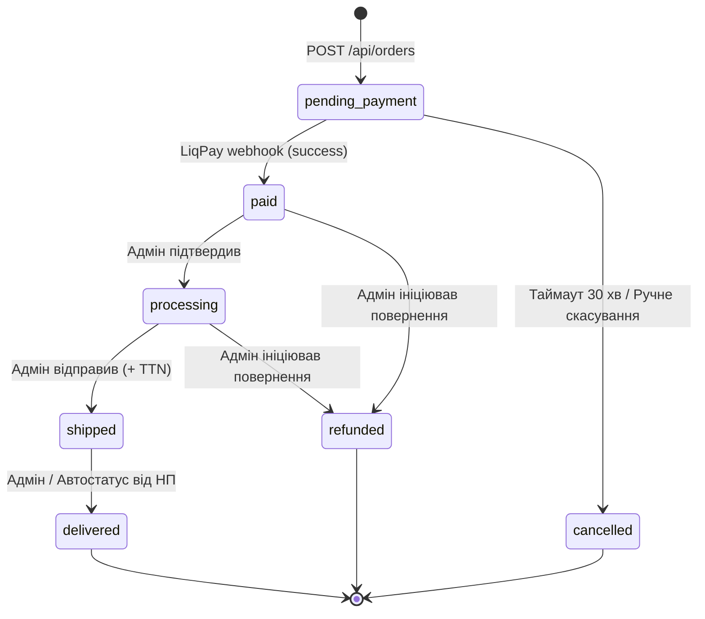

# 🛒 Архітектура та Життєвий Цикл Замовлень (Order Workflow v2)

Цей документ детально описує логіку обробки замовлень в AquaWheel Store: від наповнення кошика до фінального підтвердження оплати, включаючи сценарії для гостей, механізми безпеки та майбутні інтеграції.

> **Версія:** 2.0 — Перероблена з урахуванням реальної кодової бази та виявлених протиріч (див. `order_workflow_analysis.md`).

---

## 👤 1. Ідентифікація Користувача (Authentication Modes)

Система підтримує два режими оформлення замовлення:

### Режим А: Авторизований клієнт
*   Користувач має активну сесію (JWT Access Token, виданий через `token.Maker`).
*   Бекенд автоматично використовує `user_id` з контексту запиту (витягується `AuthMiddleware`).
*   Адреси доставки підтягуються зі збережених `user_address` записів (через `UserAddressRepository.FindAllByUserID()`).

### Режим Б: Гість (Silent Registration Flow) — БЕЗПЕКА 🔐

Якщо користувач не залогінений, система діє за наступним алгоритмом:

1.  **Ввід Даних:** Клієнт вказує Email, ПІБ та Номер Телефону на сторінці чекаута.
2.  **Перевірка Email:**
    *   Якщо Email **вже є** в БД (`UserRepository.FindByEmail()` знаходить запис):
        *   Замовлення створюється **без прив'язки** до існуючого `user_id`.
        *   Контактні дані зберігаються **безпосередньо** в таблиці `order` (поля `first_name`, `last_name`, `email`, `phone`).
        *   `order.user_id` залишається `NULL`.
        *   На email відправляється повідомлення: *"Було створено замовлення з вашим email. Якщо це не ви — зверніться до підтримки."*
        *   **Обґрунтування:** Ми не прив'язуємо замовлення до чужого акаунту без доказу володіння, щоб запобігти зловживанням.
    *   Якщо Email **новий** — Система тихо створює новий запис `User` в БД (див. крок 3).
3.  **Тиха Реєстрація (Silent Registration):**
    *   Новий `User` створюється **окремим методом** `OrderService.silentRegister()` (НЕ через `AuthService.Register()`), щоб обійти стандартні перевірки:
        *   `RoleID = 1` (Customer)
        *   `AuthProvider = "guest_checkout"`
        *   `IsEmailVerified = false`
        *   `IsPhoneVerified = false`
        *   `IsBlocked = false`
    *   Генерується криптографічний пароль (≥32 символи через `crypto/rand`), хешується та записується в БД. **Пароль НІКОМУ не передається.**
    *   Замовлення прив'язується до нового `user_id`.
4.  **Вхід в акаунт:**
    *   Для майбутнього входу клієнт використовує **"Забув пароль"** (`ForgotPassword` → `ResetPassword`).
    *   **Важливо:** Метод `ResetPassword` повинен додатково **встановлювати `IsEmailVerified = true`** після успішного скидання, оскільки сам факт отримання email з кодом підтверджує право володіння поштою. Це вирішує проблему, де `Login()` блокує невірифікованих юзерів.

    ```go
    // В ResetPassword, після зміни пароля, всередині Atomic:
    if !user.IsEmailVerified {
        user.IsEmailVerified = true
    }
    ```
5.  **Повідомлення на UI:** Фронтенд повідомляє клієнту, що для нього створено акаунт, і він зможе увійти через "Забув пароль".

---

## 📱 2. Механізм Майбутньої Верифікації Телефону (Proof-of-Verification)

> **Статус:** 🔮 Майбутня фаза (Phase 2). Наразі чекаут працює без верифікації телефону.

Щоб уникнути спам-замовлень, архітектура розрахована на **Stateless OTP** перевірку:

### 2.1 Необхідні зміни в інфраструктурі (перед імплементацією)

Перед реалізацією цього механізму потрібна **міграція БД:**
```sql
-- Зробити user_id nullable в verify_code (зараз NOT NULL)
ALTER TABLE verify_code ALTER COLUMN user_id DROP NOT NULL;
```

Також потрібно оновити Go-модель `VerifyCode`:
```go
// Було:
UserID uuid.UUID `gorm:"type:uuid;not null"`
// Стане:
UserID *uuid.UUID `gorm:"type:uuid"` // Nullable для guest OTP
```

### 2.2 Алгоритм

1.  **Запит SMS:** Гість вводить номер → тисне "Підтвердити" → `POST /api/auth/verify-phone/request`.
    *   Бекенд зберігає `VerifyCode` у таблиці: `target = "+380..."`, **`user_id = NULL`**, `type = "phone_verification"`.
2.  **Підтвердження:** Гість вводить 4/6 цифр → `POST /api/auth/verify-phone/confirm`.
3.  **Proof Token:** При успіху бекенд повертає короткоживучий (10 хв) підписаний **JWT токен** через існуючий `token.Maker`:
    ```json
    { "phone": "+380...", "verified": true, "exp": "<+10 min>" }
    ```
4.  **Чекаут:** Фронтенд розблоковує кнопку "Оформити". При натисканні у payload `POST /api/orders` додається поле `verification_token`.
5.  **Валідація:** Бекенд валідує підпис токена через `token.Maker.VerifyToken()`. Якщо валідний — замовлення створюється. **Стан (Session) на сервері не зберігається.**

---

## 🔄 3. Повний Життєвий Цикл Замовлення (Step-by-Step)

### Крок 1: Ініціалізація (POST `/api/orders`)

**Ендпоінт:** `POST /api/:lang/orders`
**Middleware:** `OptionalAuthMiddleware` + `SessionMiddleware` (аналогічно до кошика/вішліста)

**Payload:**
```json
{
  "delivery": {
    "provider": "novaposhta",
    "delivery_type": "warehouse",
    "city_ref": "...",
    "city_name": "...",
    "warehouse_ref": "...",
    "warehouse_name": "..."
  },
  "guest": {
    "email": "guest@example.com",
    "first_name": "Іван",
    "last_name": "Іваненко",
    "phone": "+380991234567"
  },
  "admin_comment": ""
}
```

**Алгоритм:**

1.  Зчитування поточного Кошика клієнта (через `CartRepository.GetByUserID()` або `CartRepository.GetBySessionID()`).
2.  **Валідація:** Кошик не порожній; всі `variation_id` актуальні та `is_active = true`.
3.  Калькуляція фінальної суми (зчитування актуальних `price` з `product_variation`).
4.  Ідентифікація/створення користувача (див. п. 1).
5.  **Атомарна транзакція в БД:**
    *   Створення запису в `order`:
        *   `order_number` — генерується через **PostgreSQL sequence** (починаючи з 10000):
          ```sql
          -- Міграція:
          CREATE SEQUENCE order_number_seq START WITH 10000;
          ALTER TABLE "order" ADD COLUMN order_number BIGINT NOT NULL DEFAULT nextval('order_number_seq');
          CREATE UNIQUE INDEX idx_order_number ON "order" (order_number);
          ```
        *   `status_id` = 1 (`pending_payment`)
        *   `user_id` = визначений UUID або NULL (для гостя з існуючим email)
        *   `first_name`, `last_name`, `email`, `phone` — **завжди копіюються** з payload (snapshot на момент замовлення)
        *   `total_price` — розрахована сума в копійках
    *   Створення записів в `order_item` — **копіювання актуальних цін** з `product_variation.price` на момент покупки.
    *   Створення запису в `delivery` — інформація про обране відділення.
    *   Створення порожнього запису в `payment` зі статусом `pending`, `amount = total_price`.
6.  **Очищення Кошика** — видалення всіх `cart_item` та самого `cart` запису.
7.  **Повернення відповіді:**
    ```json
    {
      "order_id": "uuid",
      "order_number": 10001,
      "total_price": 125000,
      "status": "pending_payment",
      "payment_url": "https://www.liqpay.ua/api/3/checkout?data=..."
    }
    ```

### Крок 2: Оплата (Bridge to Payment)

1.  Фронтенд отримує підтвердження створення замовлення з `payment_url`.
2.  Фронтенд виконує **redirect** на платіжний шлюз LiqPay.
3.  Замовлення перебуває в статусі `pending_payment` (id=1).

**Формування LiqPay запиту (на бекенді):**
```go
// Мінімальний набір параметрів для LiqPay API
params := map[string]string{
    "action":      "pay",
    "amount":      formatAmount(order.TotalPrice), // копійки → гривні
    "currency":    "UAH",
    "description": fmt.Sprintf("Замовлення №%d — AquaWheel Store", order.OrderNumber),
    "order_id":    order.ID.String(),
    "version":     "3",
    "result_url":  cfg.FrontendURL + "/order/" + order.ID.String() + "/success",
    "server_url":  cfg.APIHost + "/api/webhooks/liqpay",
}
```

### Крок 3: Callback / Webhook (Після оплати)

**Ендпоінт:** `POST /api/webhooks/liqpay`

> **⚠️ Безпека:** Цей ендпоінт **НЕ має** auth middleware. Замість цього валідація відбувається через перевірку підпису LiqPay (`signature = base64(sha1(private_key + data + private_key))`).

**Маршрутизація в `router.go`:**
```go
// Webhook група — БЕЗ AuthMiddleware, з окремою валідацією
webhookGrp := api.Group("/webhooks")
{
    paymentHttp.RegisterWebhookRoutes(webhookGrp, paymentServ, logger.Log)
}
```

**Алгоритм:**
1.  LiqPay надсилає POST-запит з полями `data` (base64-encoded JSON) та `signature`.
2.  Бекенд валідує `signature`: `base64(sha1(private_key + data + private_key))`.
3.  Декодує `data` з base64, парсить JSON.
4.  **Якщо `status = "success"` або `status = "sandbox"`:**
    *   Оновлює запис `payment`: `status = "success"`, `transaction_id = liqpay_order_id`.
    *   Оновлює статус замовлення `order.status_id` → 2 (`paid`).
    *   **Trigger Notifications** — запуск відправки листів (див. п. 4).
5.  **Якщо `status = "failure"` або `status = "error"`:**
    *   Оновлює `payment.status = "failed"`, записує `error_message`.
    *   Статус замовлення залишається `pending_payment`.
6.  **Ідемпотентність:** Перевіряти, чи payment вже в статусі `success` перед оновленням, щоб уникнути дублювання при повторних webhook'ах.
7.  Повернення `200 OK` (LiqPay вимагає).

---

## 📧 4. Система Сповіщень (Notifications)

### 4.1 Необхідні зміни в інфраструктурі

#### Розширення `email.Provider` інтерфейсу:
```go
// internal/platform/email/provider.go
type Provider interface {
    SendVerificationEmail(to, code, link string) error
    SendPasswordResetEmail(to, code, link string) error
    // Нові методи для замовлень:
    SendOrderConfirmationEmail(to string, data OrderEmailData) error
    SendAdminOrderNotification(to string, data OrderEmailData) error
}

// OrderEmailData — дані для формування листа про замовлення
type OrderEmailData struct {
    OrderNumber  int
    CustomerName string
    Items        []OrderItemEmail
    TotalPrice   int        // в копійках
    Delivery     DeliveryEmail
    IsNewUser    bool       // чи це Silent Registration
}

type OrderItemEmail struct {
    Name     string
    Quantity int
    Price    int // ціна за одиницю в копійках
    Total    int // quantity * price в копійках
}

type DeliveryEmail struct {
    Provider      string
    CityName      string
    WarehouseName string
}
```

#### Нові HTML-шаблони:
Додати в `internal/platform/email/templates.go`:
*   `buildOrderConfirmationEmailHTML()` — лист клієнту
*   `buildAdminOrderNotificationEmailHTML()` — лист адміну

#### Додавання `ADMIN_NOTIFICATION_EMAIL` в конфігурацію:
```go
// internal/platform/config/config.go — додати в Config struct:
AdminNotificationEmail string

// В Load():
adminNotificationEmail := os.Getenv("ADMIN_NOTIFICATION_EMAIL")
if adminNotificationEmail == "" {
    log.Println("Warning: ADMIN_NOTIFICATION_EMAIL is not set. Admin order notifications will be skipped.")
}
```

### 4.2 Логіка відправки

Після успішної оплати (webhook callback) сервер відправляє 2 листи **асинхронно через goroutine:**

```go
// В PaymentService, після оновлення статусу:
go func() {
    if err := s.emailProvider.SendOrderConfirmationEmail(order.Email, emailData); err != nil {
        s.logger.Error("failed to send order confirmation email", zap.Error(err))
    }
    if s.cfg.AdminNotificationEmail != "" {
        if err := s.emailProvider.SendAdminOrderNotification(s.cfg.AdminNotificationEmail, emailData); err != nil {
            s.logger.Error("failed to send admin order notification", zap.Error(err))
        }
    }
}()
```

> **Примітка:** Для MVP використовуємо goroutine. Для production (Phase 2) — впровадити channel-based worker queue в `internal/jobs/`.

### Лист 1: Клієнту (Customer Email)
*   **Тема:** `Ваше замовлення №10001 успішно оформлено!`
*   **Зміст:**
    *   Деталі замовлення (список товарів, формули типу `2 × 100 = 200 ₴`).
    *   Реквізити доставки (провайдер, місто, відділення).
    *   Інформація про статус.
    *   Якщо `IsNewUser = true` — блок: *"Для вас створено акаунт. Для входу скористайтесь функцією 'Забув пароль' на сторінці авторизації."*

### Лист 2: Адміністратору (Admin Notification)
*   **Одержувач:** `ADMIN_NOTIFICATION_EMAIL` з ENV змінної.
*   **Зміст:** Технічна виписка для менеджерів для негайного збору замовлення на складі (номер, ПІБ, телефон, список товарів з SKU, адреса доставки).

---

## 📊 5. Статуси Замовлення (Order Status Lifecycle)

Таблиця `order_status` — довідникова, з JSONB назвами (uk/en). Необхідна **seed-міграція:**

```sql
-- migrations/000XXX_seed_order_statuses.up.sql
INSERT INTO order_status (id, code, name, sort_order) VALUES
  (1, 'pending_payment', '{"uk":"Очікує оплати","en":"Pending Payment"}', 1),
  (2, 'paid',            '{"uk":"Оплачено","en":"Paid"}', 2),
  (3, 'processing',      '{"uk":"В обробці","en":"Processing"}', 3),
  (4, 'shipped',         '{"uk":"Відправлено","en":"Shipped"}', 4),
  (5, 'delivered',       '{"uk":"Доставлено","en":"Delivered"}', 5),
  (6, 'cancelled',       '{"uk":"Скасовано","en":"Cancelled"}', 6),
  (7, 'refunded',        '{"uk":"Повернено","en":"Refunded"}', 7);

SELECT setval('order_status_id_seq', 7);
```

**Діаграма переходів:**



---

## 📦 6. Управління Складом (Inventory Policy)

Згідно з поточними вимогами, система **НЕ виконує** операції автоматичного списання товарів (`product_variation.stock_quantity` не зменшується при замовленні). Облік залишків ведеться вручну або через зовнішню ERP систему, що мінімізує ризики блокування продажів через помилки синхронізації.

> **Phase 2:** Можлива реалізація м'якого резервування (soft reserve) — зменшення `stock_quantity` при створенні замовлення та повернення при скасуванні/таймауті.

---

## 🗂️ 7. Структура Модулів (Module Architecture)

Для імплементації необхідно створити наступні модулі за усталеним паттерном проєкту:

### `internal/order/`
```
order/
├── domain/
│   └── order.go          # Order, OrderItem, OrderRepository, OrderService
├── repository/
│   └── postgres/
│       └── order_repository.go
├── service/
│   └── order_service.go   # Бізнес-логіка створення замовлення
└── delivery/
    └── http/
        ├── handler.go     # HTTP handlers
        ├── dto.go         # Request/Response DTOs
        └── routes.go      # RegisterOrderRoutes()
```

### `internal/payment/`
```
payment/
├── domain/
│   └── payment.go        # Payment, PaymentRepository, PaymentService
├── repository/
│   └── postgres/
│       └── payment_repository.go
├── service/
│   └── payment_service.go # LiqPay інтеграція, webhook обробка
└── delivery/
    └── http/
        ├── handler.go     # Webhook handler
        └── routes.go      # RegisterWebhookRoutes()
```

### Реєстрація в `router.go`:
```go
// 4.5 Ініціалізація модуля Order
orderRepo := orderPostgres.NewOrderRepository(db, logger.Log)
orderServ := orderSvc.NewOrderService(orderRepo, cartRepo, prodRepo, emailProvider, cfg, logger.Log)

// 4.6 Ініціалізація модуля Payment
paymentRepo := paymentPostgres.NewPaymentRepository(db, logger.Log)
paymentServ := paymentSvc.NewPaymentService(paymentRepo, orderRepo, emailProvider, cfg, logger.Log)

// Routes
orderHttp.RegisterOrderRoutes(optionalAuthLangGrp, authLangGrp, adminGrp, orderServ, logger.Log)

// Webhook група — БЕЗ AuthMiddleware
webhookGrp := api.Group("/webhooks")
paymentHttp.RegisterWebhookRoutes(webhookGrp, paymentServ, logger.Log)
```

---

## 🔧 8. Необхідні Міграції (Summary)

| # | Файл міграції | Опис |
|---|---------------|------|
| 1 | `000024_add_order_number.up.sql` | Додати `order_number` з sequence (start 10000) |
| 2 | `000025_seed_order_statuses.up.sql` | Seed-дані для `order_status` |
| 3 | `000026_add_liqpay_config.up.sql` | (опціонально) таблиця для конфігурації LiqPay |

> **Примітка:** Міграція для `verify_code.user_id = nullable` потрібна лише при імплементації Phase 2 (верифікація телефону).

---

## 🔐 9. Нові ENV-змінні

```env
# Адмін сповіщення
ADMIN_NOTIFICATION_EMAIL=orders@aquawheel.store

# LiqPay
LIQPAY_PUBLIC_KEY=sandbox_XXXXXX
LIQPAY_PRIVATE_KEY=sandbox_XXXXXX
```
